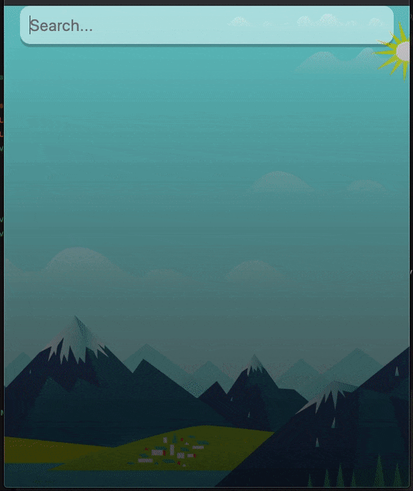

# React Weather App

[]

# A simple React App built to learn React work flow.

  - Makes calls to weather API based on use input
  - Background image updates to reflect returned weather from API call
 

# ToDo
  - react-google-places to auto fill locations and maximize user expereince
  

### Tech
* [React] - A JavaScript library for building user interfaces

License
----

MIT

